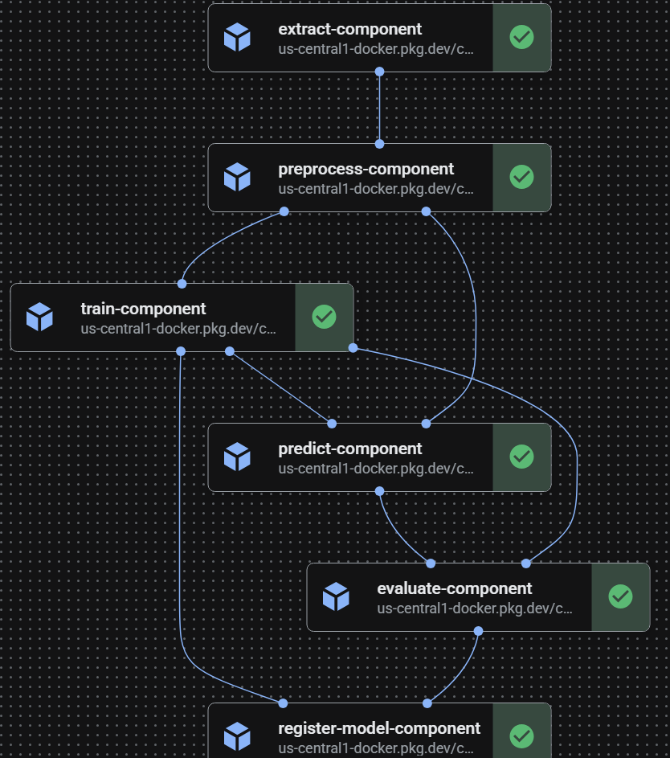

# News Topic Classifier

A production-ready ML system that fine-tunes BERT to classify BBC news articles into 5 categories: **business**, **entertainment**, **politics**, **sport**, and **tech**.

Built on Google Cloud Platform with Vertex AI pipelines, MLflow experiment tracking, a Cloud Run inference API, and a fully automated GitHub Actions CI/CD workflow.

---

## Architecture

```
BigQuery (BBC News)
       │
       ▼
┌──────────────────────────────────────────────────────────────────────┐
│                    Vertex AI Training Pipeline                       │
│                                                                      │
│  Extract → Preprocess → Train → Predict → Evaluate → Register       │
│   (BQ)     (Parquet)   (BERT)  (Test set) (Metrics) (Model Registry)│
└──────────────────────────────────────────────────────────────────────┘
                          │                      │
                          ▼                      ▼
                    GCS Buckets          Vertex AI Model Registry
                  (data + models)        (versioned artifacts)
                          │
              ┌───────────┴──────────────┐
              ▼                          ▼
┌─────────────────────────┐  ┌──────────────────────────────────────┐
│  Vertex AI Inference    │  │         Cloud Run                    │
│  Pipeline (daily batch) │  │                                      │
│                         │  │  FastAPI /predict  ◄── Dashboard     │
│  Fetch → Infer → Write  │  │  (authenticated)       (Streamlit)   │
│  (BQ)   (BERT) (BQ)     │  │                                      │
└────────────┬────────────┘  └──────────────────────────────────────┘
             │
             ▼
    BigQuery predictions table
             │
             ▼
    Streamlit Dashboard
    ├── Live Inference (API call)
    ├── Daily Accuracy
    ├── Label Distribution
    ├── Confusion Matrix
    ├── Per-Class Metrics (Precision / Recall / F1)
    └── LLM Evaluation (Gemini-as-judge)
```



---

## Training Pipeline

**Six-step Kubeflow Pipelines v2 workflow** (`pipelines/training_pipeline.py`):

| Step | Component | Description |
|------|-----------|-------------|
| 1 | `extract.py` | Pull articles from BigQuery public dataset |
| 2 | `preprocess.py` | Clean text, stratified 80/10/10 split → GCS Parquet |
| 3 | `train.py` | Fine-tune `bert-base-uncased` with AdamW + MLflow tracking |
| 4 | `predict.py` | Run inference on held-out test set |
| 5 | `evaluate.py` | Generate classification report + plots |
| 6 | `register_model.py` | Register fine-tuned model to Vertex AI Model Registry |

---

## Inference Pipeline

**Three-step on-demand batch pipeline** (`pipelines/inference_pipeline.py`):

| Step | Component | Description |
|------|-----------|-------------|
| 1 | `fetch_inference_data.py` | Draw a random sample of 100 articles from BigQuery (`ORDER BY RAND() LIMIT 100`) |
| 2 | `run_batch_inference.py` | Load BERT from GCS, run mini-batch classification, add `predicted_label` column |
| 3 | `write_inference_results.py` | Stream-insert original columns + `predicted_label` into BigQuery |

The output table preserves all source columns (`title`, `body`, `category`) and appends a single `predicted_label` column, making it easy to compare BERT predictions against the ground-truth category.

Triggered manually via **GitHub Actions → Run Inference Pipeline → Run workflow** (choose `dev` or `prd`).

---

## Live Inference API

A FastAPI container (`api/`) deployed to Cloud Run exposes:

| Endpoint | Method | Description |
|----------|--------|-------------|
| `/health` | `GET` | Returns `200 ok` when model is loaded, `503` while loading |
| `/predict` | `POST` | Classify one or more news texts |

**Request:**
```json
{
  "instances": [
    {"text": "Apple reported record quarterly earnings driven by iPhone sales..."}
  ]
}
```

**Response:**
```json
{
  "predictions": [
    {"label": "tech", "confidence": 0.9821, "scores": {"business": 0.009, "tech": 0.982, ...}}
  ]
}
```

The Cloud Run service is authenticated (`--no-allow-unauthenticated`). The Streamlit dashboard fetches an OIDC ID token automatically via `google.oauth2.id_token.fetch_id_token`, cached for 55 minutes.

---

## Monitoring Dashboard

A Streamlit app (`dashboard/`) deployed to Cloud Run with six tabs:

| Tab | Description |
|-----|-------------|
| **Live Inference** | Paste any text and classify it in real time via the API |
| **Daily Accuracy** | Line chart of classification accuracy per day with running average |
| **Label Distribution** | Stacked bar chart of predictions per category per day |
| **Confusion Matrix** | All-time heatmap of true vs predicted labels |
| **Per-Class Metrics** | Precision / Recall / F1 / Support per category + accuracy vs confidence drift chart |
| **LLM Evaluation** | Sample recent predictions, classify them with Gemini 1.5 Flash, compare BERT vs Gemini accuracy and agreement rate |

All BigQuery queries are cached for 5 minutes (`@st.cache_data(ttl=300)`). The OIDC token for the API is cached for 55 minutes.

---

## Model

| Parameter | Value |
|-----------|-------|
| Base model | `bert-base-uncased` (110M params) |
| Max sequence length | 512 tokens |
| Epochs | 5 (early stopping patience: 3) |
| Batch size | 8 |
| Learning rate | 2e-5 (linear warmup + decay) |
| Warmup steps | 100 |
| Optimizer | AdamW (weight decay: 0.01) |

Labels: `business`, `entertainment`, `politics`, `sport`, `tech`

Dataset: [`bigquery-public-data.bbc_news.fulltext`](https://console.cloud.google.com/marketplace/product/bbc/bbc-news)

---

## Project Structure

```
news-topic-classifier/
├── api/                        # FastAPI inference service (Cloud Run)
│   ├── main.py                 # /health + /predict endpoints
│   ├── predictor.py            # Model download, loading, mini-batch inference
│   └── Dockerfile
├── dashboard/                  # Streamlit monitoring dashboard (Cloud Run)
│   ├── app.py                  # 6-tab Streamlit app
│   ├── bq_queries.py           # BigQuery SQL for all dashboard queries
│   └── Dockerfile
├── pipelines/                  # Vertex AI pipeline definitions (KFP v2)
│   ├── training_pipeline.py    # 6-step training pipeline
│   ├── inference_pipeline.py   # 3-step daily inference pipeline
│   ├── run_pipeline.py         # Compile + submit training pipeline
│   ├── run_inference_pipeline.py # Compile + submit inference pipeline
│   └── components/
│       ├── extract.py
│       ├── preprocess.py
│       ├── train.py
│       ├── predict.py
│       ├── evaluate.py
│       ├── register_model.py
│       ├── fetch_inference_data.py
│       ├── run_batch_inference.py
│       └── write_inference_results.py
├── scripts/
│   ├── batch_predict.py        # Standalone daily batch inference (no Vertex AI)
│   └── register_model.py       # Manual model registration CLI
├── news_topic_classifier/      # Core Python package
│   └── modeling/               # BERT classifier, training loop, inference, reports
├── conf/                       # Hydra configuration
│   ├── environment/            # dev / pp / prd GCP settings
│   ├── model/                  # BERT hyperparameters
│   ├── training/               # Optimizer, scheduler, epochs
│   └── data/                   # BigQuery table, GCS paths
├── docker/                     # Base and trainer Dockerfiles
├── tests/                      # Unit and integration tests
├── .github/workflows/          # CI/CD workflows
└── requirements/               # Layered dependency files
```

---

## Prerequisites

- Python 3.11+
- [uv](https://github.com/astral-sh/uv) (recommended) or pip
- Docker
- GCP project with the following APIs enabled:
  - BigQuery, Cloud Storage, Vertex AI, Artifact Registry, Cloud Run
- [Workload Identity Federation](https://cloud.google.com/iam/docs/workload-identity-federation) configured for GitHub Actions

---

## Installation

```bash
# Core dependencies
make install

# With development extras (Jupyter, plotting)
make install-dev

# With test extras
make install-test

# Dashboard only (Streamlit + Plotly + Gemini)
make install-dashboard
```

---

## Configuration

All configuration is managed with [Hydra](https://hydra.cc/). The main entrypoint is `conf/config.yaml`, which composes from:

```
conf/
├── config.yaml            # root config
├── environment/
│   ├── dev.yaml           # cs-cdwp-data-dev2188
│   ├── pp.yaml            # cs-cdwp-data-pp2188
│   └── prd.yaml           # cs-cdwp-data-prd2188
├── model/default.yaml     # BERT hyperparameters
├── training/default.yaml  # optimizer, scheduler, epochs
└── data/default.yaml      # BigQuery table, GCS paths
```

---

## Running Locally

### Build and test Docker images

```bash
# Build base + trainer images
make docker-build

# Build individual images
make docker-build-api
make docker-build-dashboard

# Smoke-test pipeline components inside the container
make docker-test-extract
make docker-test-preprocess RAW_GCS_URI=gs://your-bucket/data/raw/
make docker-test-train      GCS_SPLITS_DIR=gs://your-bucket/data/processed/
make docker-test-predict    GCS_SPLITS_DIR=gs://your-bucket/data/processed/
make docker-test-all
```

### Start local services

```bash
# MLflow UI at http://localhost:5000
docker compose up mlflow

# FastAPI serving container at http://localhost:8080
# Requires MODEL_GCS_URI and GCP_PROJECT environment variables
MODEL_GCS_URI=gs://your-bucket/models/bert-bbc-finetuned/ \
GCP_PROJECT=cs-cdwp-data-dev2188 \
docker compose --profile api up api

# Streamlit dashboard at http://localhost:8501
# Start the API first, then:
docker compose --profile dashboard up dashboard
```

### Run Python modules directly

```bash
python -m news_topic_classifier.dataset          # Extract from BigQuery
python -m news_topic_classifier.features         # Preprocess & split
python -m news_topic_classifier.modeling.train   # Fine-tune BERT
python -m news_topic_classifier.modeling.predict # Run inference
python -m news_topic_classifier.modeling.report  # Generate report
```

---

## Submitting Pipelines

### Training pipeline

```bash
# Default: dev environment
python pipelines/run_pipeline.py

# Specific environment
python pipelines/run_pipeline.py environment=prd

# Force fresh run (disable Vertex AI caching)
python pipelines/run_pipeline.py environment=dev enable_caching=False

# Override hyperparameters
python pipelines/run_pipeline.py training.epochs=10 training.lr=3e-5
```

### Inference pipeline

```bash
# Submit to prd (random 100-article sample)
python pipelines/run_inference_pipeline.py environment=prd

# Via Make
make run-inference-pipeline ENV=prd
make run-inference-pipeline ENV=dev
```

Both pipelines compile to `pipelines/compiled/` before submission.

### Standalone batch inference (no Vertex AI)

For quick local runs without a Vertex AI pipeline job:

```bash
make batch-predict ENV=prd
make batch-predict ENV=dev DAY=5
```

---

## Registering a Model

After a successful training run the pipeline registers the model automatically. To register manually:

```bash
# Register the default model path for dev
python scripts/register_model.py --environment dev

# Register a specific GCS URI
python scripts/register_model.py --environment prd \
    --gcs-model-uri gs://cs-cdwp-data-prd2188-model-artifacts/models/bert-bbc-finetuned/

# Pin a custom display name and version note
python scripts/register_model.py --environment prd \
    --display-name "bert-bbc-v2" \
    --version-description "Trained 2026-06-01, val_acc=0.97"
```

Each call creates a new **version** of the same `display-name` model resource — Vertex AI handles version history automatically.

---

## CI/CD (GitHub Actions)

| Workflow | Trigger | Description |
|----------|---------|-------------|
| `test.yml` | PR to `develop`/`main`, push to `develop` | Run unit test suite (no GCP) |
| `build.yml` | Push to `develop` (source or dashboard files) | Build and push `base`, `trainer`, `api`, `dashboard` images to dev Artifact Registry |
| `run_pipeline.yml` | After `build.yml` succeeds, or manual | Submit Vertex AI **training** pipeline |
| `run_inference_pipeline.yml` | Manual (`workflow_dispatch`) | Submit Vertex AI **inference** pipeline to dev or prd |
| `promote.yml` | Manual (main branch only) | Promote all images dev → prd via `gcrane copy`, deploy `api` + `dashboard` to Cloud Run (prd), then trigger prd training pipeline |
| `integration_test.yml` | Push to `main`, or manual | Run integration tests against dev GCP environment |

Authentication uses [Workload Identity Federation](https://cloud.google.com/iam/docs/workload-identity-federation) — no long-lived service account keys are stored in GitHub secrets.

### Promotion flow

When `promote.yml` runs on `main`:
1. `gcrane copy` promotes `base`, `trainer`, `api`, `dashboard` images dev → prd (exact digest, no rebuild)
2. Copies base model weights from dev GCS to prd GCS
3. Deploys `api` image to Cloud Run (prd) and captures the service URL
4. Deploys `dashboard` image to Cloud Run (prd), injecting `GCP_PROJECT=cs-cdwp-data-prd2188`, `BQ_DATASET=DATA_SCNCE_DATA`, and the live `API_URL`
5. Triggers the prd training pipeline via `workflow_dispatch`

---

## MLflow Tracking

Experiments are tracked on MLflow servers hosted on Cloud Run:

| Environment | Endpoint |
|-------------|----------|
| dev | https://mlflow-tracking-server-eeh43tst7q-uc.a.run.app |
| pre-prod | https://mlflow-tracking-server-nityigrfzq-uc.a.run.app |
| prod | https://mlflow-tracking-server-wngg5g6m6q-uc.a.run.app |

Each training run logs: hyperparameters, per-epoch train/val accuracy, best model checkpoint path (GCS URI), and a final classification report.

> **Note:** OIDC tokens for the Cloud Run MLflow server expire after 1 hour. The training loop refreshes the token before each epoch's `log_metrics` call to handle long CPU training runs.

---

## Testing

```bash
# Run all unit tests
make test

# Run with coverage report
make test-cov

# Run a specific file
pytest tests/unit/test_dataset.py -v
```

### Unit test coverage

All tests mock GCP clients and avoid loading real BERT weights. A shared `_FakeModel` (tiny `nn.Linear`) and `_FakeTokenizer` in [tests/conftest.py](tests/conftest.py) stand in for the full model, keeping the suite fast.

| File | What's covered |
|------|----------------|
| [test_dataset.py](tests/unit/test_dataset.py) | `_gcs_output_path` URI format, `_build_extraction_query` SQL, `BBCNewsDataset` tensor shapes / dtypes |
| [test_features.py](tests/unit/test_features.py) | `_build_preprocessing_query` SQL (split labels, FARM_FINGERPRINT, NFKC normalisation), `_gcs_split_output_paths` |
| [test_model.py](tests/unit/test_model.py) | `build_model` id2label/label2id config, `build_optimizer_scheduler`, `build_dataloaders`, `train_epoch` / `eval_epoch` |
| [test_predictor.py](tests/unit/test_predictor.py) | `compute_metrics`, `run_inference` output shapes / softmax probabilities, `save_predictions` Parquet schema |
| [test_report.py](tests/unit/test_report.py) | `plot_training_curves`, `plot_confusion_matrix`, `plot_per_class_metrics` — PNG written to disk |
| [test_register_model.py](tests/unit/test_register_model.py) | KFP component: return value, init args, routes/port, label keys, serving container defaults; script: `_ENV_CONFIG` completeness, GCS URI inference, CLI arg parsing |
| [test_inference_components.py](tests/unit/test_inference_components.py) | `fetch_inference_data`: RAND/LIMIT-100 query, raises on empty result, fixed GCS URI, upload called; `run_batch_inference`: row count, `predicted_label` present and valid, original columns preserved; `write_inference_results`: row count, `create_table(exists_ok=True)`, insert called with correct table ref, RuntimeError on BQ errors |
| [test_bq_queries.py](tests/unit/test_bq_queries.py) | All 8 query functions: project/dataset interpolation; `per_class_metrics`: all 5 labels, SAFE_DIVIDE, precision/recall/f1/support; `performance_trend`: accuracy + avg_confidence; `llm_eval_sample`: LIMIT `n`, RAND(), body/label columns; `recent_predictions`: day window; `summary_stats`: accuracy, confidence, first/latest run |

### Integration tests

Integration tests hit real GCP services (BigQuery, GCS, MLflow) in the dev environment. The Make targets set `INTEGRATION_TESTS=true` automatically — no manual env var required:

```bash
make integration-test        # Tier 1 — data pipeline only (~3 min)
make integration-test-full   # Tier 2 — full pipeline including training (~25 min)
```

**`tests/integration/test_pipeline.py`** — training pipeline:

| Test | Tier | What it does |
|------|------|-------------|
| `test_01_extract` | 1 | Pull 500 rows from BigQuery → GCS Parquet |
| `test_02_preprocess` | 1 | Clean + stratified split → 3 GCS Parquet files |
| `test_03_train` | 2 (`slow`) | Download splits → 1-epoch BERT fine-tune → GCS model |
| `test_04_predict` | 2 (`slow`) | Load model → test-set inference → GCS predictions |
| `test_05_report` | 2 (`slow`) | MLflow data + predictions → plots + Word doc on GCS |
| `test_06_register_model` | 2 (`slow`) | Register fine-tuned model to Vertex AI Model Registry via KFP component |

**`tests/integration/test_inference_pipeline.py`** — inference pipeline:

| Test | Tier | What it does |
|------|------|-------------|
| `test_07_fetch_inference_data` | 1 | Fetch random-100 sample from BigQuery → GCS Parquet at `inference/samples/input.parquet`; verifies URI and blob exists |
| `test_08_run_batch_inference` | 2 (`slow`) | Load BERT from GCS, run inference on fetched Parquet; verifies `predicted_label` column and original columns are present |
| `test_09_write_inference_results` | 2 (`slow`) | Stream-insert predictions into a dedicated BQ test table; verifies row count; auto-deletes test table on cleanup |

---

## Development

```bash
make install-lint   # installs ruff and mypy

ruff check .        # lint
ruff format .       # auto-format
mypy news_topic_classifier/
```

---

## GCP Resource Summary

| Resource | Dev | Prd |
|----------|-----|-----|
| Project | `cs-cdwp-data-dev2188` | `cs-cdwp-data-prd2188` |
| Region | `us-central1` | `us-central1` |
| GCS data bucket | `cs-cdwp-data-dev2188-model-data` | `cs-cdwp-data-prd2188-model-data` |
| GCS artifacts bucket | `cs-cdwp-data-dev2188-model-artifacts` | `cs-cdwp-data-prd2188-model-artifacts` |
| Artifact Registry | `us-central1-docker.pkg.dev/{project}/news-topic-classifier` | same pattern |
| BigQuery dataset | `DATA_SCNCE_DEV_DATA` | `DATA_SCNCE_DATA` |
| Predictions table | `news_topic_classifier_predictions` | `news_topic_classifier_predictions` |
| Cloud Run — API | `news-topic-classifier-api` | `news-topic-classifier-api` |
| Cloud Run — Dashboard | `news-topic-classifier-dashboard` | `news-topic-classifier-dashboard` |
| Vertex AI SA | `vertex-ai-sa@cs-cdwp-data-dev2188.iam.gserviceaccount.com` | same pattern for prd |
| Training resource | 8 vCPU / 32 GB RAM | same |

---

## License

[MIT](LICENSE)
